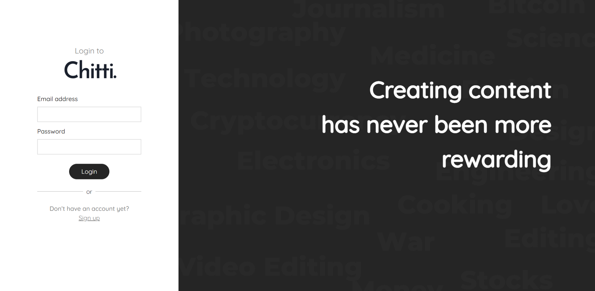
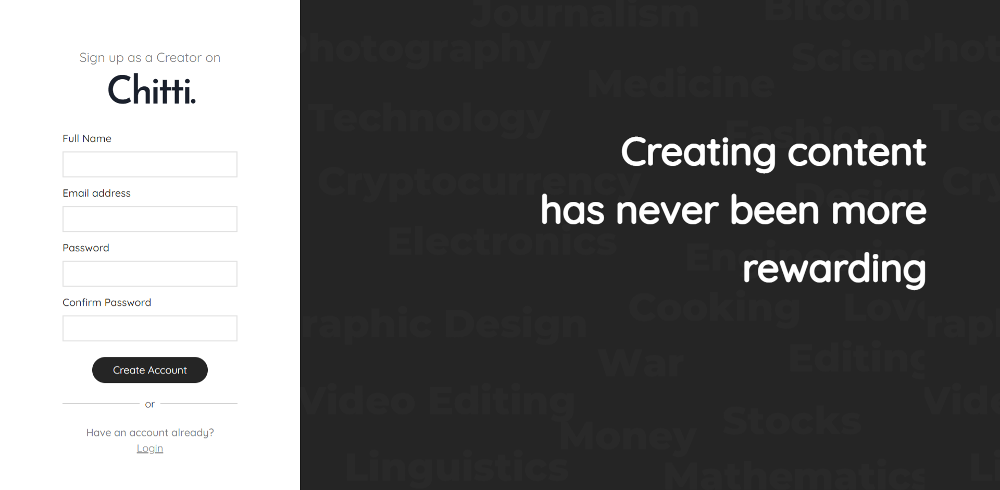
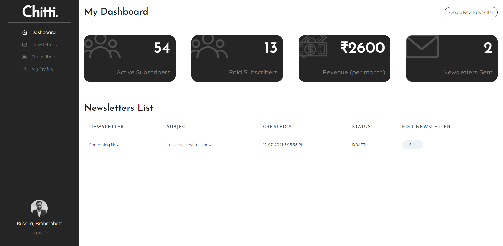
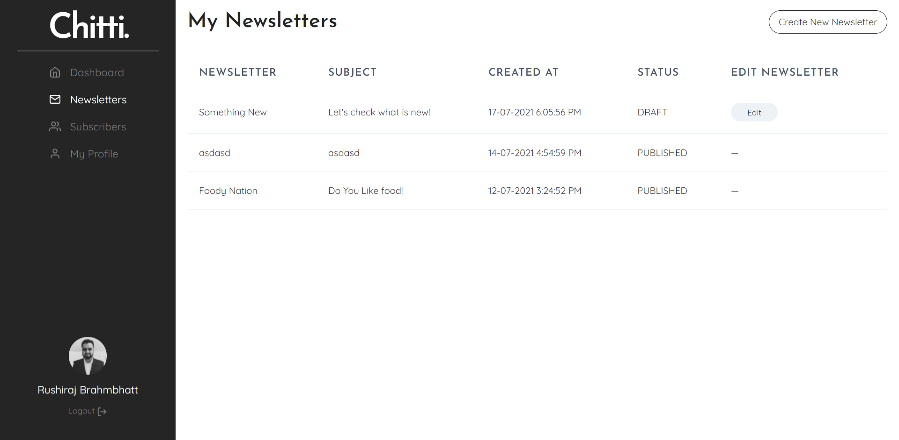
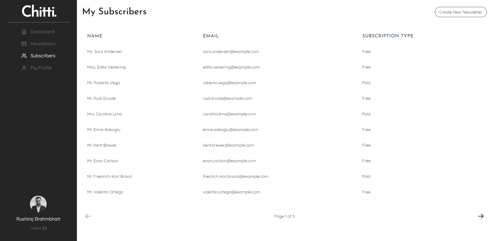
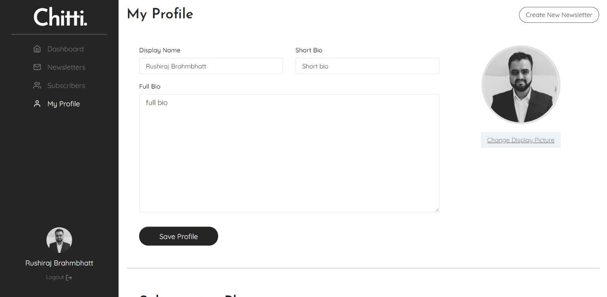
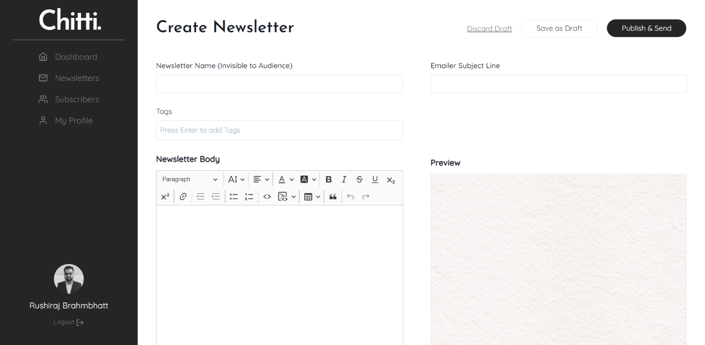
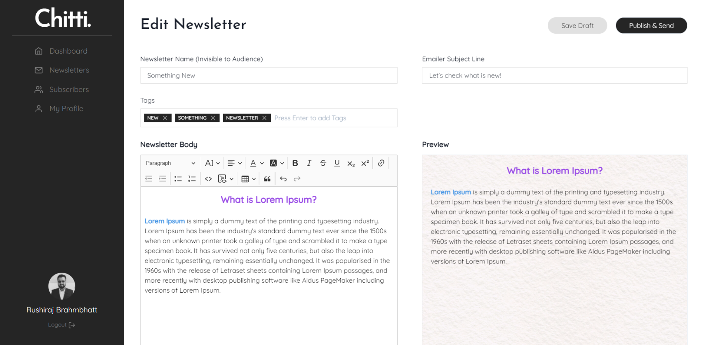

# Chitti

---

### In one line,

Chitti is a Newsletter publication and distribution platform to help Content creators reach their audience directly andmonetize from the loyal ones.

### Who is this for?

Content creators are often not rewarded for the quality of their content due to the limitations and nuances of their Social Media algorithms. Chitti intends to provide a platform for them to write, publish and distribute their content in its purest form via newsletters directly to their audience inboxes.

### How do they Benefit?

Creators can easily publish their content and reach only their select and interested audience, and in doing so, are rewarded directly by those who find value in their content.

Audiences who are interested in specific creators often end up paying directly (Magazine subscriptions) or indirectly (Offering data to Social media apps) way more than what they are required to. With Chitti, they can only subscribe to their favourite creators and enjoy their content without the clutter.

### How is this different?

Unlike Wordpress or Medium, Chitti doesn't charge anything upfront. We only make money when creators do. Also, creators’ content reaches the audience directly, eliminating the need to visit the creators’ website / blog every time there is new content.

Unlike Social Media, the audience and creators are actually connected directly to each other, without all the unnecessary noise and clutter of the platform.

---

# Implementation

This is a [Next.js](https://nextjs.org/) project. You will need the following components before you can implement this system

- A MongoDB server, running locally or on cloud
- A SendGrid Account, for sending emails

## System Requirements

Following system requirements need to be met in order for this application to run

- Node.js 12.0 or later
- MacOS, Windows (including WSL), and Linux are supported

## Environment

Following environment variables need to be set for the application to run

- `MONGO_URL` : MongoDB URL string
- `MONGO_DB`: MongoDB database name
- `APPLICATION_SECRET`: A random string at least 15 characters long, used to encrypt user sessions
- `SENDGRID_DASHBOARD_KEY`: API key for the SendGrid account
- `VERCEL_URL`: Your local preview URL (Usually `http://localhost:3000`)

## Running Locally

First, clone this repository to your local machine

```bash
git clone https://github.com/pesto-students/n3-epsilon-chitti.git
```

Open the project folder in terminal and install required dependencies:

```bash
yarn install
```

run the development server:

```bash
yarn dev
```

Open [http://localhost:3000](http://localhost:3000) with your browser to see the result.

## Testing

Run the following command on terminal to run the tests

```bash
yarn test
```

## Deploying

The easiest way to deploy this app is to use the [Vercel Platform](https://vercel.com/new?utm_medium=default-template&filter=next.js&utm_source=create-next-app&utm_campaign=create-next-app-readme) from the creators of Next.js.

Check out the [Next.js deployment documentation](https://nextjs.org/docs/deployment) for more details.

This project is currently deployed on Vercel. You can visit [Chitti Dashboard App](https://n3-epsilon-chitti.vercel.app)

## Screenshots

### Login Page



### Signup Page



### Dashboard Home Page



### Dashboard Newsletters Page



### Dashboard Subscribers Page



### Dashboard MyProfile Page



### Create Newsletter Page



### Edit Newsletter Page


